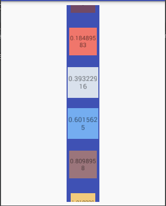

# PercentOnScrollListener

Here is an android lib for RecyclerView.OnScrollListener.
This lib contains a `PercentOnScrollLisenter` and a simple implement `ScaleOnScrollLisenter`.
(Only works with LinearLayoutManger now, both vertical and horizontal.)

The `PercentOnScrollLisenter` convert `onScrolled(RecyclerView, int, int)` to `onScrolled(View, float)`
which makes it easy to perform animations on each `itemView` with a particular percent.
 
Here's a preview of the `ScaleOnScrollListener`:
  
 
 
The `ScaleOnScrollListener` scaled both top and bottom items, and you can see how the `percent` is changing.
This could used to simulate a `Gallary` or a `ViewPager` with `LinearSnapHelper`.

This lib only provide OnScrollListener, which means these items is added by the default layout order,
  so the center item is not cover others. 
  
## Download
[PercentOnScrollListener.aar](./release/PercentOnScrollListener.aar)
or just copy and paste those source code in `lib`.

## References
+ [CarouselLayoutManager](https://github.com/Azoft/CarouselLayoutManager), provide LayoutManger which 
 allows center item cover others, and scale, but some recyclerView's scroll api may lose its original function.
+ [ViewPagerLayoutManager](https://github.com/leochuan/ViewPagerLayoutManager), provide more LayoutManagers,
 allows center item cover others, scale, rotate and so on. But does not support vertical, said..
 
 
